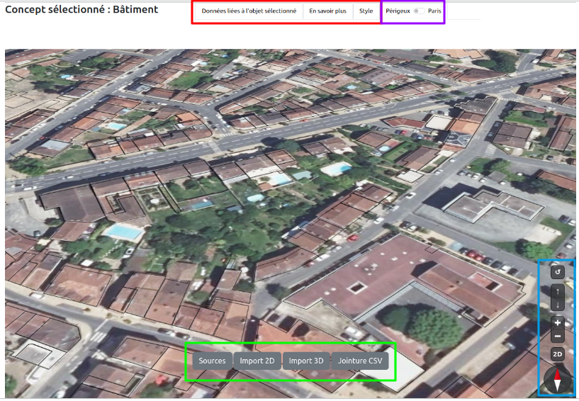
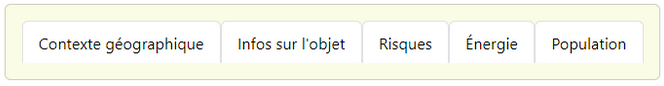
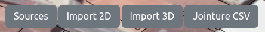
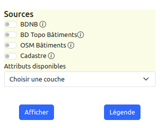
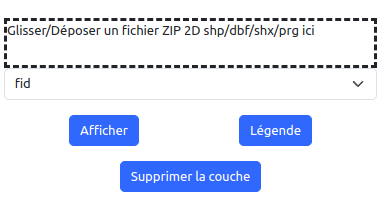
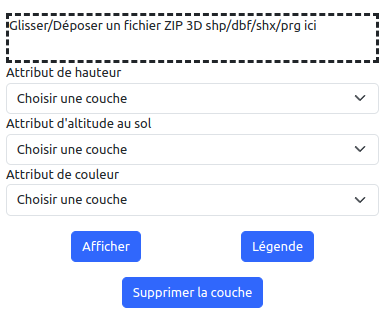
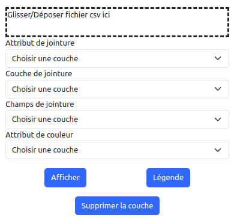
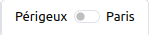
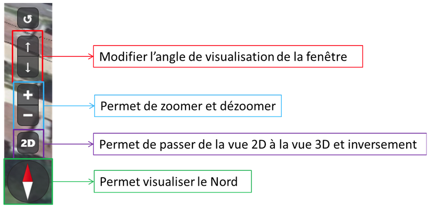

# Manuel utilisateur
Bienvenue dans le manuel utilisateur de notre logiciel de data visualisation. Ce logiciel est conçu pour vous aider à naviguer et visualiser facilement les données.
Si vous voulez tester notre outil, en voici le déploiement le plus récent : https://enzovenon.github.io/Gemini_numeriques/ 
Si vous souhaitez voir le code et la version la plus récente du programme, vous pouvez cloner le dépôt au lien suivant : https://github.com/EnzoVenon/Gemini_numeriques.git 

---
## Interface
Notre interface utilisateur est représentée dans l’image ci-dessous

---
## Cadre rouge
###  Données liées à l’objet sélectionné
Lorsque vous cliquez sur “Données liées à l’objet sélectionné”, vous allez accéder à d’autres menus : 

Pour accéder aux informations, il faut d’abord sélectionner un bâtiment.
- Le volet “Contexte géographique” va vous permettre de visualiser des informations concernant l’endroit que vous souhaitez analyser : la région, la commune, le code postal, le nombre d’habitants de cette commune, le nombre d'hectares de la commune, …
- Le volet “Infos sur l'objet” va vous permettre de visualiser des données détaillées sur les objets, ici les bâtiments. Vous pouvez accéder à  des informations telles que ses dimensions, son nombre d’étages,...
- Le volet “Risques” vous permet d’afficher des données sur différents types de risques, tels que les risques naturels (pour l’instant seulement les risques inondation et radon). Vous pouvez afficher les zones à risque et les bâtiments impactés par les inondations.
- Le volet “Énergie” vous permet de visualiser des données détaillées l'émission de gaz à effet de serre et la consommation énergétique des logements. 
- Le volet “Population” vous permet d'afficher des données sur la population, tel que le nombre d'habitants. Vous pouvez afficher des graphiques et des diagrammes pour visualiser les caractéristiques de la population avec différentes répartitions.

### En savoir plus
Lorsque vous cliquez sur “En savoir plus”, vous pouvez accéder à des informations comme le contour des bâtiments des différentes sources de données, aux liens vers les sources de données ainsi que le schéma d’intégration des différentes bases de données. 

### Style
Lorsque vous cliquez sur “Style”, vous pourrez accéder à une stylisation des couches de données. Avec la case à cocher, vous pouvez choisir si vous souhaitez afficher les bâtiments en 3D. Vous pouvez ensuite choisir des styles prédéfinis pour ensuite les afficher grâce au bouton “Afficher”. Vous pouvez afficher la légende grâce au bouton Légende.

--- 

## Cadre vert 

- Sources permet d’afficher les sources de données : BDNB, BD Topo Bâtiments, OSM Bâtiments et Cadastre (voir ci-dessous). Cependant, les différentes sources ne peuvent pas être vues simultanément.

Une autre fonctionnalité, c’est que vous catégoriser les bâtiments grâce à un attribut (Attributs disponibles). La visualisation se mettra à jour et les différents attributs possibles seront colorés. 
Grâce à “Afficher”, vous pouvez appliquer la catégorisation. Avec “Légende”, vous pouvez afficher la légende de la catégorisation (avec les valeurs des attributs possibles associés à leur couleur). 

- En sélectionnant Import 2D, vous accédez au menu d’import de fichiers 2D. On pourra y ajouter des fichiers zip contenant un SHP, DBF, SHX et PRG qui seront affichés dans la carte.

Vous pourrez ensuite choisir le champ qui vous permettra de catégoriser vos bâtiments : la liste se chargera à la place de “Déposer un zip”. 
Grâce à “Afficher”, vous pouvez appliquer la catégorisation. Avec “Légende”, vous pouvez afficher la légende de la catégorisation (avec les valeurs des attributs possibles associés à leur couleur). Grâce à “Supprimer la couche”, vous pouvez la supprimer de la visualisation. 

- En sélectionnant Import 3D, vous accédez au menu d’import de fichiers 3D. On pourra y ajouter des fichiers zip contenant un SHP, DBF, SHX et PRG qui seront affichés dans la carte.

Vous devrez ensuite choisir les champs de hauteur, d’altitude au sol ainsi que le champ qui vous permettra de catégoriser (de votre couche). 
Grâce à “Afficher”, vous pouvez appliquer la catégorisation. Avec “Légende”, vous pouvez afficher la légende de la catégorisation (avec les valeurs des attributs possibles associés à leur couleur). Grâce à “Supprimer la couche”, vous pouvez la supprimer de la visualisation. 

- En sélectionnant Jointure CSV, vous accédez au menu d’import de fichiers csv. On pourra y ajouter des fichiers csv qui vont ensuite se lier automatiquement avec la couche de données choisie (de notre produit).

Vous devrez ensuite choisir les champs de votre csv avec lequel vous allez faire la jointure, la couche avec laquelle vous allez joindre votre csv, puis son champ et enfin la couleur qui va vous permettre de catégoriser.  
Grâce à “Afficher”, vous pouvez appliquer la catégorisation. Avec “Légende”, vous pouvez afficher la légende de la catégorisation (avec les valeurs des attributs possibles associés à leur couleur). Grâce à “Supprimer la couche”, vous pouvez la supprimer de la visualisation. 

---

## Cadre violet 
Le bouton va vous permettre d'accéder au 11ème arrondissement de Paris.
Cette fonctionnalité vous permet d’accéder à d’autres données : la population synthétique. Ce sont des données simulées que nous avons uniquement sur cette zone. 

A droite, vous vous déplacerez sur Paris et à gauche sur Périgueux : 

---

## Cadre bleu
Les boutons suivants vont permettre de réaliser certaines actions que vous pouvez aussi réaliser grâce à des commandes. 

- Clic enfoncé + déplacement de la souris → déplacement dans la vue.
- CTRL + Clic gauche enfoncé en déplaçant la souris → Modifier l’orientation de la vue à 360° (de haut en bas ainsi que latéralement). 
- Roulement de la molette → zoom et dézoom
- MAJ + Clic gauche enfoncé en déplaçant la souris → Mouvement autour d’un point à 360° (de haut en bas ainsi que latéralement). 
